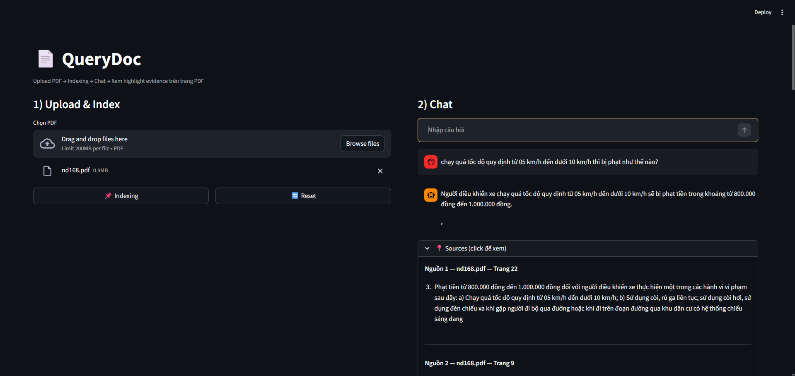
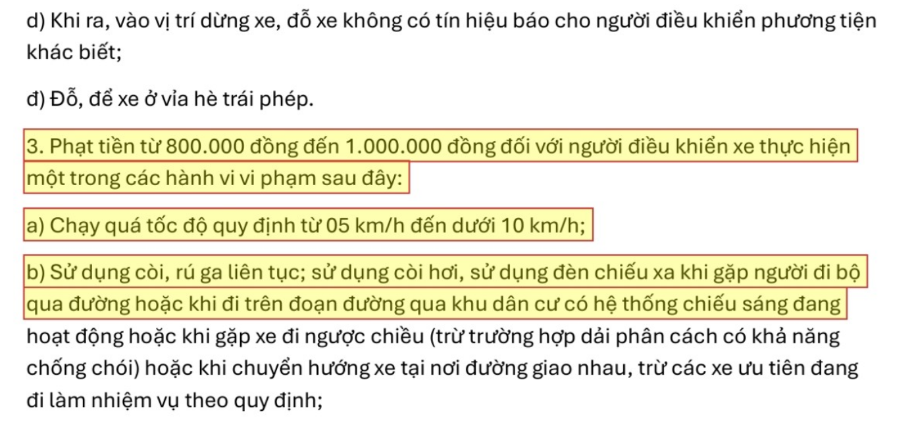

# 📄 QueryDoc — Hybrid PDF RAG with Evidence Viewer

**QueryDoc** is a document question-answering system built on **Hybrid Retrieval (BM25 + Vector Search)** that allows users to chat with PDF documents while **verifying answers directly on the original pages with precise highlights**.

> **Core Idea:** Don’t just answer questions — show the evidence.

---

## 📺 Demo Video
*(Click the badge below to watch QueryDoc in action)*

[](https://youtu.be/zgT5YYwKriM)

---

## ✨ Key Features
- 🔎 **Hybrid Retrieval**: BM25 + Vector Search + RRF
- 📍 **Citations with exact page references**
- 🖍️ **Evidence Viewer** with bounding-box highlights

---

## 🖥️ Demo UI

| Chat Interface | Evidence Viewer |
|---------------|-----------------|
|  |  |

*Chat with documents on the left, inspect evidence on a separate page with precise highlights.*

---

## 🗺️ System Pipeline


---

## 🚀 Quickstart

### 1️. Clone the repository
```bash
git clone https://github.com/lhldanh/querydoc.git
cd querydoc
```
### 2. Activate your environment
```bash
# Windows
.\rag_env\Scripts\activate

# Linux / macOS
source rag_env/bin/activate
```
### 3. Install dependencies
```bash
pip install -r requirements.txt
```
Requirements: Ollama running locally with a supported LLM (e.g. `qwen2.5`, `llama3`).

### 4. Run the app
```bash
streamlit run src/app.py
```

---

## 🧠 Architecture

- **Ingestion:** PDF → passages + bounding boxes

- **Indexing:**
    - BM25 for keyword search
    - Vector embeddings for semantic search

- **Retrieval:** Hybrid Retrieval with Reciprocal Rank Fusion (RRF)

- **Generation:** LLM answers strictly based on retrieved passages

- **Verification:** Evidence Viewer highlights exact source text

---

## 📚 License
MIT License
